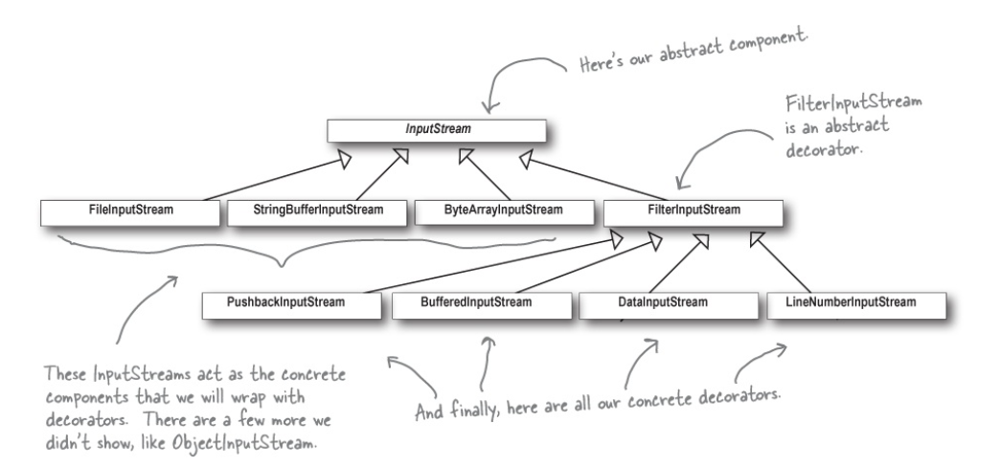

Decorator Pattern
======================

The `Decorator Pattern` attaches additional responsibilities to an object dynamically. Decorators provide a flexible
alternative to subclassing for extending functionality. 

*Decorators* have the same supertype as the objects they decorate. Objects can be decorated at any time, so we can decorate
objects dynamically at runtime with as many decorators as we like.

Given the *Decorator* has the same supertype as the object it decorates, we can pass around a decorated object in place
of the original (wrapped) object.

The *Decorator* adds its own behavior either before and/or after delegating to the object it decorates to the rest of the job.

   

In our example we simulated the catalog of beverages at Starbuzz Coffee. There are three different beverages: *Espresso*,
*DarkRoast* and *HouseBlend*, each one with a specific description and price. The client can customize a beverage adding 
condiments to it, like *Mocha* and *Soy*. Each condiment increase the cost of the beverage. Using `Decorator Pattern` we
are able to add more beverages and condiments without change existing components. Furthermore, this pattern allows us
customize beverages at runtime.

## Relationship with other patterns

`Adapter` changes the interface of an existing object, while `Decorator` enhances an object without changing its interface.
In addition, *Decorator* supports recursive composition, which isn't possible when you use *Adapter*.

`Adapter` provides a different interface to the wrapped object, `Proxy` provides it with the same interface, and `Decorator`
provides it with an enhanced interface.

`Composite` and `Decorator` have similar structure diagrams, since both rely on recursive composition to organize an 
open-ended number of objects.

## Pros and Cons

### Pros

+ You can extend an object's behavior without making a new subclass.
+ You can add or remove responsibilities from an object at runtime.
+ You can combine several behaviors by wrapping an object into multiple decorators.
+ `Single Responsibility Principle`. You can divide a monolithic class that implements many possible variants of behavior
into several smaller classes.

### Cons

+ It's hard to remove a specific wrapper from the wrappers stack.
+ It's hard to implement a decorator in such a way that its behavior doesn't depend on the order in the decorators stack.
+ The initial configuration code of layers might look like pretty ugly.

## Applicability

**Use the Decorator Pattern when you need to be able to assign extra behaviors to object at runtime without breaking the
code that uses these objects**

The *Decorator* lets you structure business logic into layers, create a decorator for each layer and compose objects with
various combinations of this logic at runtime. The client code can treat all these objects in the same way, since they all
follow a common interface.

**Use the pattern when it's awkward or not possible to extend an object behavior using inheritance**

Many programming languages have the `final` keyword that can can be used to prevent further extension of a class.
For a final class, the only way to reuse the existing behavior would be to wrap the class with your own wrapper, using the
*Decorator* pattern,

## Real world examples

The I/O classes in the `java.io` package is largely based on *Decorator*.

`FileInputStream`, `BufferedInputStream` and `LineNumberInputStream` are a typical set of objects that use decorators 
to add functionality to reading data from a file. *BufferedInputStream* and *LineNumberInputStream* both extend *FileInputStream*,
which acts as the abstract decorator class.

  

Java I/O also points out one of the downsides of the `Decorator Pattern`: designs using this pattern often result in large
number of small classes that can be overwhelming to a developer trying to use decorator-based API.

