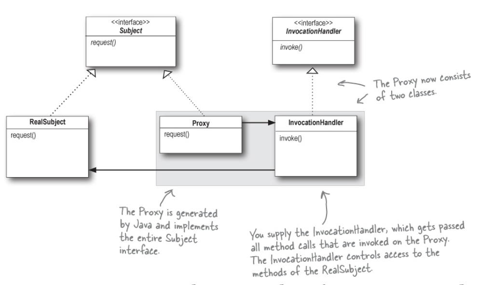

Proxy Pattern
======================

This package is a sample about the `Proxy` Pattern. The main goal is serve as a explanation about how proxy pattern works.

## Overview

Proxy is a pattern that may be useful when you need to control and manage access to another objects. 

There are several ways in which proxies stand in for the objects they proxy, and the variations typically revolve the way
the proxy "control access". The most known type of proxies are: `Remote proxy`, `Virtual Proxy` and `Protection Proxy`.

  

### Remote Proxy

A `Remote Proxy` controls access to a remote object. It acts as a local representative to a remote object. 
What's a "remote object"? It's an object that lives in the heap of a different Java Virtual Machine (or more generally, a 
remote object that is running in a different address space). What's a "local representative"? It's an object that you can 
call local methods on and have them forwarded on to the remote object.

In our example we used the `Java RMI library`, which generates a local representative (`stub`) that forwards all requests to 
a remote object (`skeleton`) previously registered on the RMI.

### Virtual Proxy

A `Virtual Proxy` controls access to a resource that is expensive to create. The virtual proxy often defers the creation of
the object until it's needed. The virtual proxy also acts as a surrogate for the object before and while it's being created.
After that, the proxy delegates requests directly to the Real Subject.

In our example we simulated an application which loads images from the internet based on a url. So, while the image is being
retrieved, the proxy shows a label with further information. After the process finishes, the proxy creates the
real object and defers the real work of showing the image to it.

### Protection Proxy

A `Protection Proxy` controls access to a resource based on access rights. This is a good example to use a slightly different
type of proxy: `Dynamic Proxy`, which allows you create a Proxy class on the fly that implements one or more interfaces
and forwards methods invocations to a class that you specify.

  

In our example we simulated a dating service. We wanted to make sure that people would just change their own 
personal information, like interests, while rating someone else would be still possible. In order to do that, we used the
`Java Proxy API` and created two `Invocation Handlers`: One for the profile owner, and another one for non owner profiles. They control 
access for all requests on the `Person object`, and throws a `IllegalAccessException` for non permitted request based on the profile.  

## Pros and Cons

### Pros

+ You can controls the service object without clients knowing about it.
+ You can manage the lifecycle of the service object when clients don't care about it.
+ The proxy works even if the service object isn't ready or isn't available.
+ `Open/Closed principle`. You can introduce new proxies without changing the service or clients.

### Cons

+ The code may become more complicated since you need to introduce a lot of new classes.
+ The response from the service might get delayed.

## Real world examples

There're dozen of real world examples of `proxy pattern` in libraries that we use on our professional or pet projects. The first one
is the `Retrofit API`, that make use of `dynamic proxy` to perform `http` requests. In the kotlin language, we have the keyword
`lazy` that acts as a `virtual proxy`, deferring the real object initialization when it's first required.
